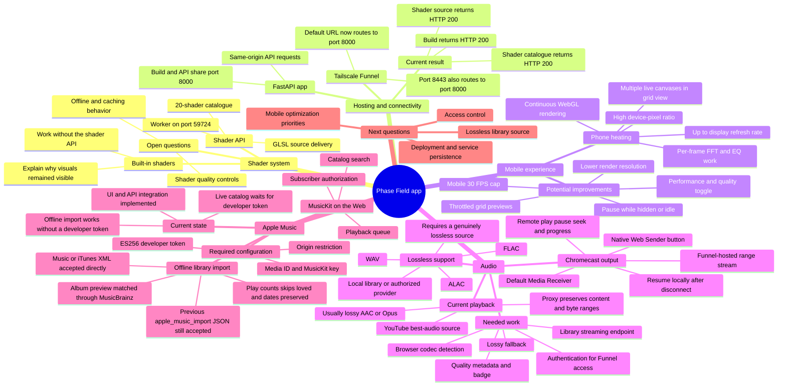

# Phase Field discussion mind map

## Current decisions and findings

- The public build and shader API now share the default Funnel origin.
- Built-in shaders provide a graceful fallback when the shader API is unavailable.
- Mobile heat is most likely caused by continuous GPU rendering and per-frame analysis.
- Lossless playback is possible, but only with a genuinely lossless source.
- Apple Music offline XML/JSON import works without a token; live MusicKit playback still awaits an origin-bound developer token.
- The earlier fallback build was recovered from `origin/codex/apple-music-fallback-import` at `944ec6a` and merged selectively into the current panel.

This document is intended to evolve as the discussion continues.
